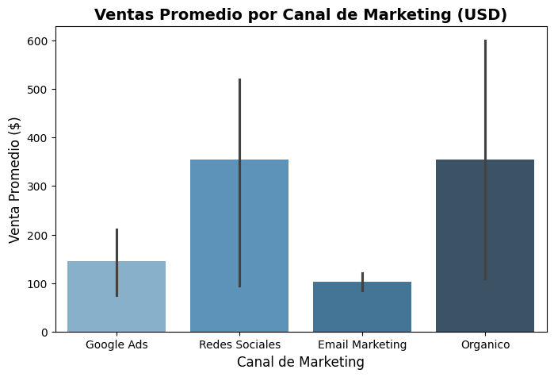

Markdown
# 📊 Análisis de Rendimiento de E-commerce y Retención de Clientes

## 📌 Contexto del Negocio
Este proyecto analiza el rendimiento de ventas, la efectividad de los canales de adquisición y la tasa de retención de clientes de una plataforma de comercio electrónico. El objetivo principal es identificar qué canales de marketing generan mayor rentabilidad y entender el comportamiento de cancelación de los usuarios.

## 🛠️ Herramientas y Librerías Utilizadas
* **Lenguaje:** Python
* **Entorno:** Google Colab / Jupyter Notebook
* **Librerías:** 
  * `Pandas` para la limpieza y manipulación de datos.
  * `Matplotlib` y `Seaborn` para la visualización gráfica de resultados.

## 📈 Hallazgos Clave del Análisis
1. **Rendimiento de Canales:** Mediante el análisis cruzado de montos de venta y costos de adquisición (CAC), se identificó cuáles canales generan un mayor margen neto de ganancia.
2. **Retención por Tipo de Contrato:** Se evaluó el comportamiento de los clientes con contratos mensuales frente a los anuales, detectando los puntos críticos de fuga (*churn*).
3. **Distribución Geográfica:** Se calcularon las ventas totales y el ticket promedio por región para orientar las pautas publicitarias.

## 📊 Visualización de Resultados
A continuación se muestra el comportamiento de las ventas promedio según el canal de marketing utilizado:

## 💡 Recomendaciones Estratégicas
* Reasignar presupuesto publicitario hacia los canales de marketing que presentan una mejor relación entre el costo de adquisición (CAC) y el monto de venta.
* Implementar estrategias de fidelización enfocadas en los contratos mensuales para reducir la tasa de cancelación.

---
*Proyecto desarrollado de forma independiente como parte del portafolio de análisis de datos.*
